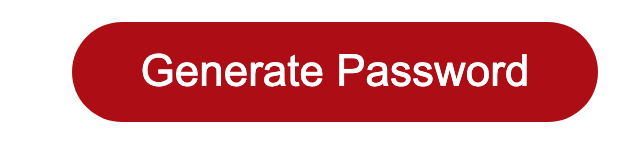
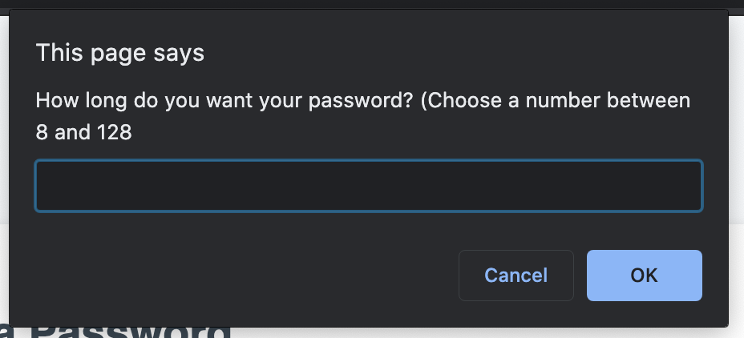
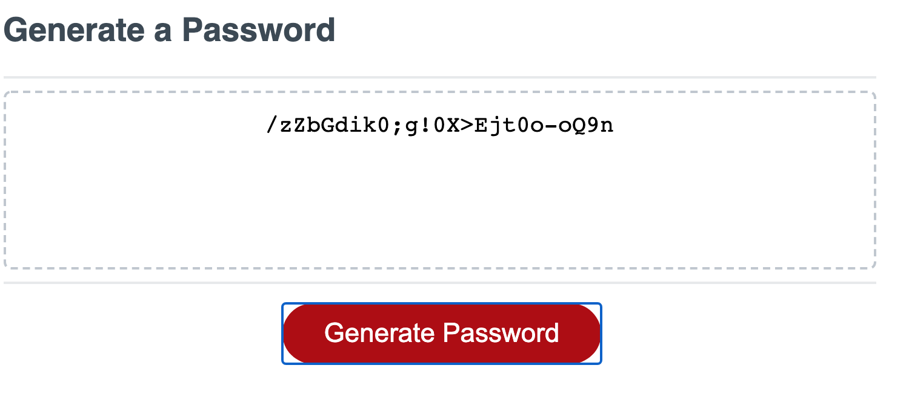
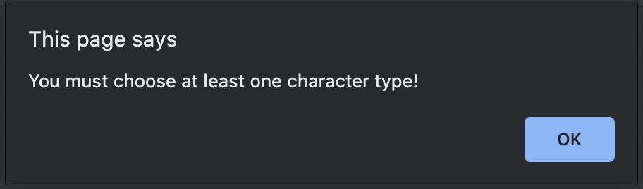
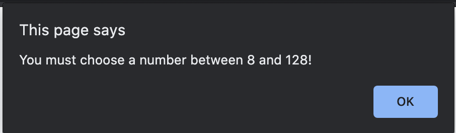

# Password Generator
This password generator allows a user to modify their desired password by what characters are used and the password length. 

When the generate password button is pushed the user is asked for the criteria for the new password. If the criteria is sufficient the password is generated.

If a user does not choose any characters the app will respond with "You must choose at least one character type!"

If the user chooses a password that is too small (less than 8), or too long (more than 128), or a non-number the app responds with "You must choose a number between 8 and 128.

## Technology used
The website and style was provided. The work that I did can be seen in the JavaScript file. I referenced Mozilla Developer Network and W3Schools to improve my use of functions, variables, loops, objects and arrays.

## Deployment
This app if fully functional with one error. If the user types in a sentance when asking for the length the program does not work. This might be due to the parseInt() function used on the user input to change the string into a number.